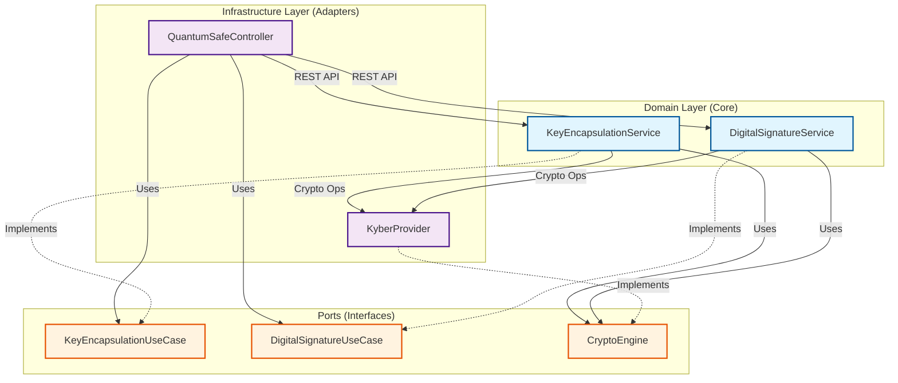

# Application Architecture

## Component Diagram

This diagram visualizes the application's components and their relationships, following the **Hexagonal Architecture (Ports and Adapters)** pattern.

## Structure Overview

-   **Input Adapter (Web)**: `QuantumSafeController` exposes REST endpoints (`/api/qs-crypto`).
-   **Input Ports**:
    -   `KeyEncapsulationUseCase`: Defines the interface for KEM operations (Kyber).
    -   `DigitalSignatureUseCase`: Defines the interface for Digital Signature operations (ML-DSA).
-   **Domain Services**:
    -   `KeyEncapsulationService`: Implements Key Encapsulation logic.
    -   `DigitalSignatureService`: Implements Digital Signature logic.
-   **Output Port**: `CryptoEngine` defines the contract for all cryptographic operations.
-   **Output Adapter (Infrastructure)**: `KyberProvider` implements the detailed cryptographic logic (Kyber/ML-KEM, AES-GCM, ML-DSA).

## Class Diagram

```mermaid
classDiagram
    class QuantumSafeController {
        -KeyEncapsulationUseCase keyEncapsulationUseCase
        -DigitalSignatureUseCase digitalSignatureUseCase
        +requestKyberPublicKey(PublicKeyRequest userRequest) PublicKeyResponse
        +decapsulateEncryptionAESGCM(DecapsulateEncryptionRequest request) DecapsulateEncryptionResponse
        +generateMLDSAKeyPair(GenerateMLDSAKeyPairRequest request) GenerateMLDSAKeyPairResponse
    }

    class KeyEncapsulationUseCase {
        <<interface>>
        +requestKyberPublicKey(String keyLabel) byte[]
        +decapsulateEncryptionAESGCM(byte[] encapsulation, byte[] iv, byte[] cryptogram, String keyLabel) byte[]
    }

    class DigitalSignatureUseCase {
        <<interface>>
        +generateMLDSAKeyPair(String keyLabel, String parameterSet)
    }

    class KeyEncapsulationService {
        -CryptoEngine cryptoEngine
        +requestKyberPublicKey(String keyLabel) byte[]
        +decapsulateEncryptionAESGCM(byte[] encapsulation, byte[] iv, byte[] cryptogram, String keyLabel) byte[]
    }

    class DigitalSignatureService {
        -CryptoEngine cryptoEngine
        +generateMLDSAKeyPair(String keyLabel, String parameterSet)
    }

    class CryptoEngine {
        <<interface>>
        +getKyberPublicKey(String keyLabel) byte[]
        +decapsulateEncryptionAESGCM(byte[] encapsulation, byte[] iv, byte[] cryptogram, String keyLabel) byte[]
        +generateMLDSAKeyPair(String keyLabel, String parameterSet)
    }

    class KyberProvider {
        -String KEM_ALGORITHM
        -int AES_KEY_SIZE_BITS
        -String SYMMETRIC_ALGORITHM
        -int GCM_NONCE_LENGTH
        -int GCM_TAG_LENGTH
        +getKyberPublicKey(String keyLabel) byte[]
        +decapsulateEncryptionAESGCM(byte[] encapsulation, byte[] iv, byte[] cryptogram, String keyLabel) byte[]
        +generateMLDSAKeyPair(String keyLabel, String parameterSet)
    }

    QuantumSafeController --> KeyEncapsulationUseCase : uses
    QuantumSafeController --> DigitalSignatureUseCase : uses
    KeyEncapsulationService ..|> KeyEncapsulationUseCase : implements
    DigitalSignatureService ..|> DigitalSignatureUseCase : implements
    KeyEncapsulationService --> CryptoEngine : uses
    DigitalSignatureService --> CryptoEngine : uses
    KyberProvider ..|> CryptoEngine : implements
```

