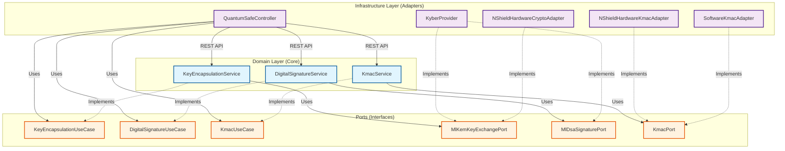

# Application Architecture

## Component Diagram

This diagram visualizes the application's components and their relationships, following the **Hexagonal Architecture (Ports and Adapters)** pattern.

```mermaid
graph TD
    %% Styling
    classDef domain fill:#e1f5fe,stroke:#01579b,stroke-width:2px;
    classDef adapter fill:#f3e5f5,stroke:#4a148c,stroke-width:2px;
    classDef port fill:#fff3e0,stroke:#e65100,stroke-width:2px;

    subgraph "Infrastructure Layer (Adapters)"
        Controller[QuantumSafeController]:::adapter
        Kyber[KyberProvider]:::adapter
        NShield[NShieldHardwareCryptoAdapter]:::adapter
        NShieldKmac[NShieldHardwareKmacAdapter]:::adapter
        SoftKmac[SoftwareKmacAdapter]:::adapter
    end

    subgraph "Domain Layer (Core)"
        KEMService[KeyEncapsulationService]:::domain
        DSService[DigitalSignatureService]:::domain
        KmacServ[KmacService]:::domain
    end

    subgraph "Ports (Interfaces)"
        KEMInPort[KeyEncapsulationUseCase]:::port
        DSInPort[DigitalSignatureUseCase]:::port
        KmacInPort[KmacUseCase]:::port
        KEMOutPort[MlKemKeyExchangePort]:::port
        DSOutPort[MlDsaSignaturePort]:::port
        KmacOutPort[KmacPort]:::port
    end

    %% Relationships
    Controller -->|Uses| KEMInPort
    Controller -->|Uses| DSInPort
    Controller -->|Uses| KmacInPort
    
    KEMService -.->|Implements| KEMInPort
    DSService -.->|Implements| DSInPort
    KmacServ -.->|Implements| KmacInPort
    
    KEMService -->|Uses| KEMOutPort
    DSService -->|Uses| DSOutPort
    KmacServ -->|Uses| KmacOutPort
    
    Kyber -.->|Implements| KEMOutPort
    Kyber -.->|Implements| DSOutPort
    NShield -.->|Implements| KEMOutPort

    NShieldKmac -.->|Implements| KmacOutPort
    SoftKmac -.->|Implements| KmacOutPort

    %% Data Flow
    Controller -- REST API --> KEMService
    Controller -- REST API --> DSService
    Controller -- REST API --> KmacServ
```

## Structure Overview

-   **Input Adapter (Web)**: `QuantumSafeController` exposes REST endpoints (`/api/qs-crypto`).
-   **Input Ports**:
    -   `KeyEncapsulationUseCase`: Defines the interface for KEM operations (Kyber/ML-KEM).
    -   `DigitalSignatureUseCase`: Defines the interface for Digital Signature operations (ML-DSA).
    -   `KmacUseCase`: Defines the interface for KMAC operations (KMAC128/KMAC256).
-   **Domain Services**:
    -   `KeyEncapsulationService`: Implements Key Encapsulation logic.
    -   `DigitalSignatureService`: Implements Digital Signature logic.
    -   `KmacService`: Implements KMAC validation and generation logic.
-   **Output Ports**:
    -   `MlKemKeyExchangePort`: Defines the contract for all key exchange and encapsulation operations.
    -   `MlDsaSignaturePort`: Defines the contract for all digital signature generation and verification operations.
    -   `KmacPort`: Defines the contract for all native/simulated KMAC operations.
-   **Output Adapters (Infrastructure)**:
    -   `KyberProvider` (Software): Implements local software-based cryptographic operations.
    -   `SoftwareKmacAdapter` (Software): Implements local simulated KMAC operations using SHA3-256.
    -   `NShieldHardwareCryptoAdapter` (Hardware): Implements HSM-based hardware ML-KEM operations via Python sidecar client calls.
    -   `NShieldHardwareKmacAdapter` (Hardware): Implements HSM-based hardware KMAC operations via Python sidecar client calls.

## Class Diagram

```mermaid
classDiagram
    class QuantumSafeController {
        -KeyEncapsulationUseCase keyEncapsulationUseCase
        -DigitalSignatureUseCase digitalSignatureUseCase
        -KmacUseCase kmacUseCase
        +RequestKyberPublicKey(PublicKeyRequest userRequest) PublicKeyResponse
        +encapsulateKyber(EncapsulateKyberRequest request) EncapsulateKyberResponse
        +DecapsulateEncryptionAESGCM(DecapsulateEncryptionRequest request) DecapsulateEncryptionResponse
        +generateMLDSAKeyPair(GenerateMLDSAKeyPairRequest request) GenerateMLDSAKeyPairResponse
        +generateMLKEMKeyPair(GenerateMLKEMKeyPairRequest request) GenerateMLKEMKeyPairResponse
        +sign(SignRequest request) SignResponse
        +verify(VerifyRequest request) VerifyResponse
        +generateKmacKey(KmacGenerateRequest request) KmacGenerateResponse
        +signKmac(KmacSignRequest request) KmacSignResponse
        +verifyKmac(KmacVerifyRequest request) KmacVerifyResponse
    }

    class KeyEncapsulationUseCase {
        <<interface>>
        +requestKyberPublicKey(String keyLabel, String outFormat) String
        +encapsulateKyber(String keyLabel) EncapsulationResult
        +decapsulateEncryptionAESGCM(byte[] encapsulation, byte[] iv, byte[] cryptogram, String keyLabel) byte[]
        +generateMLKEMKeyPair(String keyLabel, String parameterSet, String outFormat) String
    }

    class DigitalSignatureUseCase {
        <<interface>>
        +generateMLDSAKeyPair(String keyLabel, String parameterSet)
        +signMLDSA(String keyLabel, byte[] data) byte[]
        +verifyMLDSA(String keyLabel, byte[] data, byte[] signature) boolean
    }

    class KmacUseCase {
        <<interface>>
        +generateKey(KmacGenerateRequest request) KmacGenerateResponse
        +sign(KmacSignRequest request) KmacSignResponse
        +verify(KmacVerifyRequest request) KmacVerifyResponse
    }

    class KeyEncapsulationService {
        -MlKemKeyExchangePort mlKemKeyExchangePort
        +requestKyberPublicKey(String keyLabel, String outFormat) String
        +encapsulateKyber(String keyLabel) EncapsulationResult
        +decapsulateEncryptionAESGCM(byte[] encapsulation, byte[] iv, byte[] cryptogram, String keyLabel) byte[]
        +generateMLKEMKeyPair(String keyLabel, String parameterSet, String outFormat) String
    }

    class DigitalSignatureService {
        -MlDsaSignaturePort mlDsaSignaturePort
        +generateMLDSAKeyPair(String keyLabel, String parameterSet)
        +signMLDSA(String keyLabel, byte[] data) byte[]
        +verifyMLDSA(String keyLabel, byte[] data, byte[] signature) boolean
    }

    class KmacService {
        -KmacPort kmacPort
        +generateKey(KmacGenerateRequest request) KmacGenerateResponse
        +sign(KmacSignRequest request) KmacSignResponse
        +verify(KmacVerifyRequest request) KmacVerifyResponse
    }

    class MlKemKeyExchangePort {
        <<interface>>
        +encapsulate(String pubKeyIdentifier) Optional~EncapsulationResult~
        +decapsulateAndDecrypt(String privKeyIdentifier, byte[] encapsulation, byte[] iv, byte[] cryptogram) Optional~byte[]~
        +generateKeyPair(String ident, String appName, String outFormat) Optional~KeyGenerationResult~
        +getPublicKey(String ident, String appName, String outFormat) Optional~PublicKeyResult~
    }

    class MlDsaSignaturePort {
        <<interface>>
        +generateMLDSAKeyPair(String keyLabel, String parameterSet)
        +signMLDSA(String keyLabel, byte[] data) byte[]
        +verifyMLDSA(String keyLabel, byte[] data, byte[] signature) boolean
    }

    class KmacPort {
        <<interface>>
        +generateKey(String ident, String algorithm, int keySizeBytes, String appName) Optional~KmacGenerateResponse~
        +sign(String keyIdentifier, String algorithm, String customizationString, int outputLenBits, byte[] payload, String appName) Optional~byte[]~
        +verify(String keyIdentifier, String algorithm, String customizationString, int outputLenBits, byte[] payload, byte[] tag, String appName) Optional~Boolean~
    }

    class KyberProvider {
        +encapsulate(String pubKeyIdentifier) Optional~EncapsulationResult~
        +decapsulateAndDecrypt(...) Optional~byte[]~
        +generateKeyPair(...) Optional~KeyGenerationResult~
        +getPublicKey(...) Optional~PublicKeyResult~
        +generateMLDSAKeyPair(String keyLabel, String parameterSet)
        +signMLDSA(String keyLabel, byte[] data) byte[]
        +verifyMLDSA(String keyLabel, byte[] data, byte[] signature) boolean
    }

    class SoftwareKmacAdapter {
        +generateKey(...) Optional~KmacGenerateResponse~
        +sign(...) Optional~byte[]~
        +verify(...) Optional~Boolean~
    }

    class NShieldHardwareCryptoAdapter {
        -RestClient restClient
        +encapsulate(String pubKeyIdentifier) Optional~EncapsulationResult~
        +decapsulateAndDecrypt(...) Optional~byte[]~
        +generateKeyPair(...) Optional~KeyGenerationResult~
        +getPublicKey(...) Optional~PublicKeyResult~
    }

    class NShieldHardwareKmacAdapter {
        -RestClient restClient
        +generateKey(...) Optional~KmacGenerateResponse~
        +sign(...) Optional~byte[]~
        +verify(...) Optional~Boolean~
    }

    QuantumSafeController --> KeyEncapsulationUseCase : uses
    QuantumSafeController --> DigitalSignatureUseCase : uses
    QuantumSafeController --> KmacUseCase : uses
    KeyEncapsulationService ..|> KeyEncapsulationUseCase : implements
    DigitalSignatureService ..|> DigitalSignatureUseCase : implements
    KmacService ..|> KmacUseCase : implements
    KeyEncapsulationService --> MlKemKeyExchangePort : uses
    DigitalSignatureService --> MlDsaSignaturePort : uses
    KmacService --> KmacPort : uses
    KyberProvider ..|> MlKemKeyExchangePort : implements
    KyberProvider ..|> MlDsaSignaturePort : implements
    NShieldHardwareCryptoAdapter ..|> MlKemKeyExchangePort : implements
    NShieldHardwareKmacAdapter ..|> KmacPort : implements
    SoftwareKmacAdapter ..|> KmacPort : implements
```
