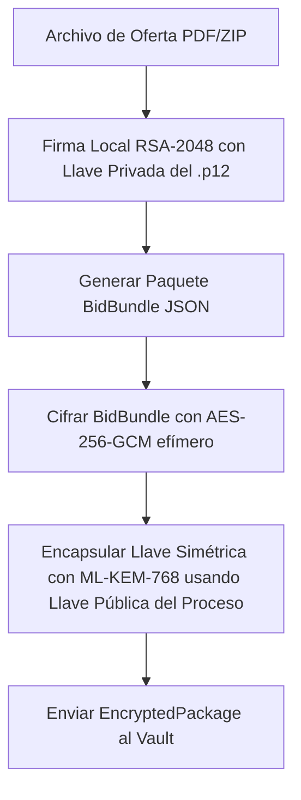

# Guía de Integración Técnica — nCripter Bidding Vault

Esta guía proporciona las instrucciones detalladas para que el personal técnico del cliente integre el **nCripter Bidding Vault** con sus sistemas y aplicaciones existentes. La plataforma ofrece un almacenamiento de ofertas con seguridad criptográfica de doble sobre, cumplimiento de firma digital avanzada (bajo la Ley 527 de 1999 de Colombia) y preparación para computación cuántica (post-quantum).

---

## 1. Arquitectura de Criptografía de Confianza Cero (Zero-Trust)

El sistema opera bajo un esquema de **Doble Sobre Criptográfico** para garantizar el secreto absoluto de las propuestas hasta el momento oficial de su apertura:

1. **Sobre Interno (Capa del Licitante / Navegador)**: El cliente firma localmente la propuesta con su certificado X.509 (`.p12`) y la cifra usando una llave simétrica efímera (AES-256-GCM). Esta llave simétrica se encapsula usando la llave pública de la licitación mediante el algoritmo post-cuántico **ML-KEM-768** (FIPS 203). La llave privada del licitante nunca sale de su estación de trabajo.
2. **Sobre Externo (Capa del Servidor del Vault)**: Al recibir el paquete cifrado, el Vault lo vuelve a cifrar con una llave simétrica persistente del servidor (llave del Vault, recuperada del HSM vía KEM al arrancar).
3. **Apertura Descentralizada**: El desencapsulado criptográfico de la llave de la licitación requiere invocar al servidor criptográfico seguro conectado al **nShield HSM**.

---

## 2. Autenticación y Autorización Delegada (JWT)

El Bidding Vault delega la autenticación de usuarios al sistema principal del cliente. El sistema del cliente debe generar un JSON Web Token (JWT) firmado (ya sea simétricamente con `HS256` usando el secreto compartido, o asimétricamente con `RS256` usando su llave privada) que incluya los permisos específicos en el campo `scopes`.

### Estructura del Token JWT Requerido
```json
{
  "sub": "usuario-identificador-unico",
  "iss": "sistema-cliente-autenticador",
  "aud": "ncripter-vault-service",
  "scopes": [
    "client:download",
    "bid:write",
    "bid:read",
    "bid:decrypt",
    "audit:read"
  ],
  "exp": 1781870400
}
```

### Tabla de Permisos por Recurso (Scopes)
- `client:download`: Autoriza la descarga del archivo portal HTML personalizado.
- `bid:write`: Permite a los licitantes cargar sus propuestas cifradas.
- `bid:read`: Permite a los compradores y auditores listar y descargar los sobres criptográficos.
- `bid:decrypt`: Permite invocar la decapsulación por proxy de la llave del proceso.
- `audit:read` / `audit:write`: Permite acceder y escribir en la bitácora de auditoría.

---

## 3. Descarga y Personalización Dinámica del Cliente Portal

Para facilitar la distribución, el cliente web se descarga como un **único archivo HTML autónomo** (`.html` autocontenido con CSS y JS en línea, sin minificar para permitir auditorías de código de seguridad).

### Flujo de Descarga
El sistema del cliente puede descargar el portal personalizado de forma programática o redirigiendo al usuario al siguiente endpoint (enviando el token de autorización en el encabezado `Authorization: Bearer <JWT>`):

```http
GET /api/client/download/orange-sas
Authorization: Bearer <JWT>
```

### ¿Cómo funciona la inyección de marca?
El servidor del Vault lee el archivo base, consulta la configuración de marca del cliente en la base de datos (colores corporativos, nombre, logotipos) e inyecta dinámicamente el siguiente bloque al inicio del archivo descargado:

```html
<script>
  window.CUSTOMER_CONFIG = {
    "customerId": "orange-sas",
    "companyName": "Orange Digital S.A.S.",
    "branding": {
      "primaryColor": "#ff5e00",
      "backgroundColor": "#0c0703",
      "textColor": "#fff5f0",
      "logoUrl": "https://midominio.com/logo.png",
      "title": "Portal de Licitaciones Orange"
    }
  };
</script>
```

Al abrir el archivo localmente (incluso sin conexión a internet), el código JavaScript interpreta estas variables y aplica los estilos visuales mediante variables CSS globales.

---

## 4. Firma y Envío de Ofertas (Licitantes)

Cuando un licitante envía una oferta, el cliente local realiza las siguientes operaciones en el navegador:



### Proceso Técnico Paso a Paso:
1. **Firma Digital (Ley 527 de 1999)**:
   El navegador lee el archivo `.p12` cargado y su contraseña, extrae la llave privada y calcula una firma digital SHA-256 con RSA de 2048 bits sobre el archivo de la oferta. Esto asegura el **no repudio** y la **autenticidad**.
2. **Construcción del Paquete de Datos (`BidBundle`)**:
   Se empaqueta el contenido del archivo original en Base64, la firma digital y el certificado público X.509 en un objeto JSON.
3. **Cifrado Simétrico**:
   Se cifra el objeto JSON usando AES-256-GCM con un vector de inicialización (IV) aleatorio de 12 bytes.
4. **Encapsulamiento Cuántico (KEM)**:
   La llave simétrica de 256 bits generada en el paso anterior se encapsula con la llave pública del proceso de licitación (`licita-001`) usando **ML-KEM-768**. Esto produce un texto cifrado de la llave (ciphertext de KEM de 1088 bytes).
5. **Carga al Vault**:
   Se envía el paquete cifrado al servidor del Vault usando el scope `bid:write`:
   ```http
   POST /api/vault/upload-bid
   Authorization: Bearer <JWT>
   Content-Type: application/json

   {
     "bidderName": "Nombre Representante Legal",
     "encryptedPackage": {
       "ciphertext": "base64...",
       "iv": "base64...",
       "encapsulatedKey": "base64..."
     }
   }
   ```

---

## 5. Apertura de Sobres de Licitaciones (Compradores)

El proceso de apertura es estrictamente auditable y se ejecuta de la siguiente manera:

### Paso 1: Descarga del sobre
El usuario comprador (o sistema de apertura) descarga el sobre cifrado usando el ID de la propuesta:
```http
GET /api/vault/download-bid/bid_1234-abcd
Authorization: Bearer <JWT>
```
*El servidor del Vault descifra automáticamente la capa del sobre externo (llave del Vault) y entrega el sobre cifrado original del licitante.*

### Paso 2: Desencapsulado de la Llave del Proceso (HSM Proxy)
El cliente local realiza una llamada al Vault (que actúa como proxy seguro hacia el servidor criptográfico con acceso al nShield HSM) para recuperar la llave simétrica efímera de la oferta enviando la llave encapsulada:
```http
POST /api/vault/decapsulate-bid
Authorization: Bearer <JWT>
Content-Type: application/json

{
  "keyLabel": "licita-001",
  "initializationVector": "iv_base64...",
  "cryptogram": "ciphertext_base64...",
  "encapsulation": "encapsulatedKey_base64..."
}
```
*El HSM realiza el desencapsulado utilizando la llave privada de la licitación y devuelve el contenido descifrado del `BidBundle` (JSON plano) al cliente.*

### Paso 3: Validación Local de la Firma Digital
En el navegador del comprador, de forma aislada, se realiza la verificación matemática:
- Se extrae el certificado X.509 público del licitante incluido en el paquete.
- Se valida que la firma RSA coincida exactamente con el archivo original descifrado.
- Si el archivo o el certificado han sufrido alguna alteración, la validación fallará inmediatamente de manera visual y lógica en el portal.

---

## 6. Bitácora de Auditoría Inmutable (HMAC-Chained Ledger)

Para garantizar la transparencia del proceso, cada operación de seguridad (emisión de llaves, cargas, descargas, aperturas y validaciones) se registra en una bitácora encadenada criptográficamente en el servidor del Vault.

### Mecanismo de Encadenamiento por HMAC-SHA256
A diferencia de un hash público tradicional (como SHA-256 simple), la bitácora del Vault utiliza un esquema de **HMAC-SHA256** utilizando una llave secreta de auditoría protegida en el entorno del servidor:

$$\text{HMAC}_n = \text{HMAC-SHA256}(\text{LlaveSecretadeAuditoría}, \text{Index} + \text{Timestamp} + \text{Event} + \text{Details} + \text{HMAC}_{n-1})$$

Esto proporciona una protección superior: incluso si un atacante obtiene acceso de escritura a la base de datos (SQLite, PostgreSQL o archivo JSON), **no podrá recomputar ni falsificar el historial de auditoría** ya que carece de la llave secreta para generar firmas HMAC válidas.

### Visualización y Verificación de Integridad
Los auditores pueden consultar el estado de la bitácora a través del siguiente endpoint:
```http
GET /api/vault/logs
Authorization: Bearer <JWT>
```

#### Ejemplo de respuesta:
```json
{
  "logs": [
    {
      "index": 0,
      "timestamp": "2026-06-19T01:40:00.000Z",
      "event": "KEY_RETRIEVAL",
      "details": "Retrieved public ML-KEM key for process licita-001",
      "previousHash": "0000000000000000000000000000000000000000000000000000000000000000",
      "hash": "8f2d6c1a..."
    },
    {
      "index": 1,
      "timestamp": "2026-06-19T01:42:00.000Z",
      "event": "BID_UPLOAD",
      "details": "Bidder 'Orange Digital S.A.S.' uploaded encrypted bid package",
      "previousHash": "8f2d6c1a...",
      "hash": "a4f9b2c3..."
    }
  ],
  "isValidLedger": true
}
```
*Si la propiedad `isValidLedger` es `false`, significa que la cadena está rota o que algún registro histórico fue alterado administrativamente de forma indebida.*
