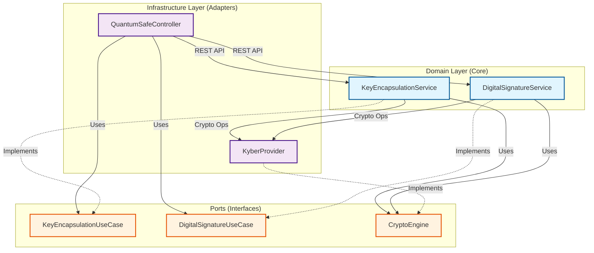

# NotebookLM Context Document: nCripterQuantumSafe

This document allows you to understand the architecture, configuration, and source code of the `nCripterQuantumSafe` project. It is structured to help you answer questions about the codebase.

## 1. Project Overview & Dependencies

### HELP.md
```markdown
# Getting Started

### Reference Documentation

For further reference, please consider the following sections:

* [Official Apache Maven documentation](https://maven.apache.org/guides/index.html)
* [Spring Boot Maven Plugin Reference Guide](https://docs.spring.io/spring-boot/3.5.7/maven-plugin)
* [Create an OCI image](https://docs.spring.io/spring-boot/3.5.7/maven-plugin/build-image.html)
* [Spring Configuration Processor](https://docs.spring.io/spring-boot/3.5.7/specification/configuration-metadata/annotation-processor.html)
* [Rest Repositories](https://docs.spring.io/spring-boot/3.5.7/how-to/data-access.html#howto.data-access.exposing-spring-data-repositories-as-rest)
* [Spring Boot DevTools](https://docs.spring.io/spring-boot/3.5.7/reference/using/devtools.html)
* [OAuth2 Client](https://docs.spring.io/spring-boot/3.5.7/reference/web/spring-security.html#web.security.oauth2.client)
* [Spring Security](https://docs.spring.io/spring-boot/3.5.7/reference/web/spring-security.html)
* [Spring Web](https://docs.spring.io/spring-boot/3.5.7/reference/web/servlet.html)

### Guides

The following guides illustrate how to use some features concretely:

* [Accessing JPA Data with REST](https://spring.io/guides/gs/accessing-data-rest/)
* [Accessing Neo4j Data with REST](https://spring.io/guides/gs/accessing-neo4j-data-rest/)
* [Accessing MongoDB Data with REST](https://spring.io/guides/gs/accessing-mongodb-data-rest/)
* [Securing a Web Application](https://spring.io/guides/gs/securing-web/)
* [Spring Boot and OAuth2](https://spring.io/guides/tutorials/spring-boot-oauth2/)
* [Authenticating a User with LDAP](https://spring.io/guides/gs/authenticating-ldap/)
* [Building a RESTful Web Service](https://spring.io/guides/gs/rest-service/)
* [Serving Web Content with Spring MVC](https://spring.io/guides/gs/serving-web-content/)
* [Building REST services with Spring](https://spring.io/guides/tutorials/rest/)

### Maven Parent overrides

Due to Maven's design, elements are inherited from the parent POM to the project POM.
While most of the inheritance is fine, it also inherits unwanted elements like `<license>` and `<developers>` from the
parent.
To prevent this, the project POM contains empty overrides for these elements.
If you manually switch to a different parent and actually want the inheritance, you need to remove those overrides.
```

### pom.xml
```xml
<?xml version="1.0" encoding="UTF-8"?>
<project xmlns="http://maven.apache.org/POM/4.0.0" xmlns:xsi="http://www.w3.org/2001/XMLSchema-instance"
         xsi:schemaLocation="http://maven.apache.org/POM/4.0.0 https://maven.apache.org/xsd/maven-4.0.0.xsd">
    <modelVersion>4.0.0</modelVersion>
    <parent>
        <groupId>org.springframework.boot</groupId>
        <artifactId>spring-boot-starter-parent</artifactId>
        <version>3.5.7</version>
        <relativePath/> <!-- lookup parent from repository -->
    </parent>
    <groupId>com.eruditsioon</groupId>
    <artifactId>nCripterQuantumSafe</artifactId>
    <version>0.0.1-SNAPSHOT</version>
    <name>nCripterQuantumSafe</name>
    <description>nCripterQuantumSafe</description>
    <url/>
    <licenses>
        <license/>
    </licenses>
    <developers>
        <developer/>
    </developers>
    <scm>
        <connection/>
        <developerConnection/>
        <tag/>
        <url/>
    </scm>
    <properties>
        <java.version>25</java.version>
    </properties>
    <dependencies>
        <dependency>
            <groupId>org.springframework.boot</groupId>
            <artifactId>spring-boot-starter-data-rest</artifactId>
        </dependency>
        <dependency>
            <groupId>org.springframework.boot</groupId>
            <artifactId>spring-boot-starter-oauth2-client</artifactId>
        </dependency>
        <dependency>
            <groupId>org.springframework.boot</groupId>
            <artifactId>spring-boot-starter-security</artifactId>
        </dependency>
        <dependency>
            <groupId>org.springframework.boot</groupId>
            <artifactId>spring-boot-starter-web</artifactId>
        </dependency>

        <dependency>
            <groupId>org.springframework.boot</groupId>
            <artifactId>spring-boot-devtools</artifactId>
            <scope>runtime</scope>
            <optional>true</optional>
        </dependency>
        <dependency>
            <groupId>org.springframework.boot</groupId>
            <artifactId>spring-boot-configuration-processor</artifactId>
            <optional>true</optional>
        </dependency>
        <dependency>
            <groupId>org.springframework.boot</groupId>
            <artifactId>spring-boot-starter-test</artifactId>
            <scope>test</scope>
        </dependency>
        <dependency>
            <groupId>org.springframework.security</groupId>
            <artifactId>spring-security-test</artifactId>
            <scope>test</scope>
        </dependency>
    </dependencies>

    <build>
        <plugins>
            <plugin>
                <groupId>org.apache.maven.plugins</groupId>
                <artifactId>maven-compiler-plugin</artifactId>
                <configuration>
                    <annotationProcessorPaths>
                        <path>
                            <groupId>org.springframework.boot</groupId>
                            <artifactId>spring-boot-configuration-processor</artifactId>
                        </path>
                    </annotationProcessorPaths>
                </configuration>
            </plugin>
            <plugin>
                <groupId>org.springframework.boot</groupId>
                <artifactId>spring-boot-maven-plugin</artifactId>
            </plugin>
        </plugins>
    </build>

</project>
```

## 2. Architecture

### architecture.md
```markdown
# Application Architecture

## Component Diagram

This diagram visualizes the application's components and their relationships, following the **Hexagonal Architecture (Ports and Adapters)** pattern.



## Structure Overview

-   **Input Adapter (Web)**: `QuantumSafeController` exposes REST endpoints (`/api/qs-crypto`).
-   **Input Ports**:
    -   `KeyEncapsulationUseCase`: Defines the interface for KEM operations (Kyber).
    -   `DigitalSignatureUseCase`: Defines the interface for Digital Signature operations (ML-DSA).
-   **Domain Services**:
    -   `KeyEncapsulationService`: Implements Key Encapsulation logic.
    -   `DigitalSignatureService`: Implements Digital Signature logic.
-   **Output Port**: `CryptoEngine` defines the contract for all cryptographic operations.
-   **Output Adapter (Infrastructure)**: `KyberProvider` implements the detailed cryptographic logic (Kyber/ML-KEM, AES-GCM, ML-DSA).

## Class Diagram

```mermaid
classDiagram
    class QuantumSafeController {
        -KeyEncapsulationUseCase keyEncapsulationUseCase
        -DigitalSignatureUseCase digitalSignatureUseCase
        +requestKyberPublicKey(PublicKeyRequest userRequest) PublicKeyResponse
        +decapsulateEncryptionAESGCM(DecapsulateEncryptionRequest request) DecapsulateEncryptionResponse
        +generateMLDSAKeyPair(GenerateMLDSAKeyPairRequest request) GenerateMLDSAKeyPairResponse
    }

    class KeyEncapsulationUseCase {
        <<interface>>
        +requestKyberPublicKey(String keyLabel) byte[]
        +decapsulateEncryptionAESGCM(byte[] encapsulation, byte[] iv, byte[] cryptogram, String keyLabel) byte[]
    }

    class DigitalSignatureUseCase {
        <<interface>>
        +generateMLDSAKeyPair(String keyLabel, String parameterSet)
    }

    class KeyEncapsulationService {
        -CryptoEngine cryptoEngine
        +requestKyberPublicKey(String keyLabel) byte[]
        +decapsulateEncryptionAESGCM(byte[] encapsulation, byte[] iv, byte[] cryptogram, String keyLabel) byte[]
    }

    class DigitalSignatureService {
        -CryptoEngine cryptoEngine
        +generateMLDSAKeyPair(String keyLabel, String parameterSet)
    }

    class CryptoEngine {
        <<interface>>
        +getKyberPublicKey(String keyLabel) byte[]
        +decapsulateEncryptionAESGCM(byte[] encapsulation, byte[] iv, byte[] cryptogram, String keyLabel) byte[]
        +generateMLDSAKeyPair(String keyLabel, String parameterSet)
    }

    class KyberProvider {
        -String KEM_ALGORITHM
        -int AES_KEY_SIZE_BITS
        -String SYMMETRIC_ALGORITHM
        -int GCM_NONCE_LENGTH
        -int GCM_TAG_LENGTH
        +getKyberPublicKey(String keyLabel) byte[]
        +decapsulateEncryptionAESGCM(byte[] encapsulation, byte[] iv, byte[] cryptogram, String keyLabel) byte[]
        +generateMLDSAKeyPair(String keyLabel, String parameterSet)
    }

    QuantumSafeController --> KeyEncapsulationUseCase : uses
    QuantumSafeController --> DigitalSignatureUseCase : uses
    KeyEncapsulationService ..|> KeyEncapsulationUseCase : implements
    DigitalSignatureService ..|> DigitalSignatureUseCase : implements
    KeyEncapsulationService --> CryptoEngine : uses
    DigitalSignatureService --> CryptoEngine : uses
    KyberProvider ..|> CryptoEngine : implements
```


```

## 3. Configuration

### application.properties
```properties
spring.application.name=nCripterQuantumSafe

# Server Configuration
server.port=4434
crypto.keyvault=./KeyVault
```

## 4. Source Code - Domain Layer (Ports & Models)

### KeyEncapsulationUseCase.java
```java
package com.eruditsioon.ncripterquantumsafe.domain.port.in;

public interface KeyEncapsulationUseCase {
    byte[] requestKyberPublicKey(String keyLabel);

    byte[] decapsulateEncryptionAESGCM(byte[] encapsulation, byte[] initializationVector, byte[] cryptogram,
            String keyLabel);

    void generateMLKEMKeyPair(String keyLabel, String parameterSet);
}
```

### DigitalSignatureUseCase.java
```java
package com.eruditsioon.ncripterquantumsafe.domain.port.in;

public interface DigitalSignatureUseCase {
    void generateMLDSAKeyPair(String keyLabel, String parameterSet);

    byte[] signMLDSA(String keyLabel, byte[] data);

    boolean verifyMLDSA(String keyLabel, byte[] data, byte[] signature);
}
```

### CryptoEngine.java
```java
package com.eruditsioon.ncripterquantumsafe.domain.port.out;

public interface CryptoEngine {
    byte[] getKyberPublicKey(String keyLabel);

    byte[] decapsulateEncryptionAESGCM(byte[] encapsulation, byte[] initializationVector, byte[] cryptogram,
            String keyLabel);

    void generateMLDSAKeyPair(String keyLabel, String parameterSet);

    void generateMLKEMKeyPair(String keyLabel, String parameterSet);

    byte[] signMLDSA(String keyLabel, byte[] data);

    boolean verifyMLDSA(String keyLabel, byte[] data, byte[] signature);
}
```

### DTOs (Data Transfer Objects)

**PublicKeyRequest.java**
```java
package com.eruditsioon.ncripterquantumsafe.domain.model;

public class PublicKeyRequest {
    private String keyLabel;

    public PublicKeyRequest() {
    }

    public PublicKeyRequest(String keyLabel) {
        this.keyLabel = keyLabel;
    }

    public String getKeyLabel() {
        return keyLabel;
    }

    public void setKeyLabel(String keyLabel) {
        this.keyLabel = keyLabel;
    }

}
```

**PublicKeyResponse.java**
```java
package com.eruditsioon.ncripterquantumsafe.domain.model;

public class PublicKeyResponse {
    private byte[] encodedPublicKey;

    public PublicKeyResponse() {
    }

    public PublicKeyResponse(byte[] encodedPublicKey) {
        this.encodedPublicKey = encodedPublicKey;
    }

    public byte[] getEncodedPublicKey() {
        return encodedPublicKey;
    }

    public void setEncodedPublicKey(byte[] encodedPublicKey) {
        this.encodedPublicKey = encodedPublicKey;
    }
}
```

**DecapsulateEncryptionRequest.java**
```java
package com.eruditsioon.ncripterquantumsafe.domain.model;

public class DecapsulateEncryptionRequest {
    private String keyLabel;
    private byte[] initializationVector;
    private byte[] cryptogram;
    private byte[] encapsulation;

    public DecapsulateEncryptionRequest() {
    }

    public DecapsulateEncryptionRequest(String keyLabel, byte[] initializationVector, byte[] cryptogram, byte[] encapsulation) {
        this.keyLabel = keyLabel;
        this.initializationVector = initializationVector;
        this.cryptogram = cryptogram;
        this.encapsulation = encapsulation;
    }

    public String getKeyLabel() {
        return keyLabel;
    }

    public void setKeyLabel(String keyLabel) {
        this.keyLabel = keyLabel;
    }

    public byte[] getInitializationVector() {
        return initializationVector;
    }

    public void setInitializationVector(byte[] initializationVector) {
        this.initializationVector = initializationVector;
    }

    public byte[] getCryptogram() {
        return cryptogram;
    }

    public void setCryptogram(byte[] cryptogram) {
        this.cryptogram = cryptogram;
    }

    public byte[] getEncapsulation() {
        return encapsulation;
    }

    public void setEncapsulation(byte[] encapsulation) {
        this.encapsulation = encapsulation;
    }
}
```

**DecapsulateEncryptionResponse.java**
```java
package com.eruditsioon.ncripterquantumsafe.domain.model;

public class DecapsulateEncryptionResponse {

    private byte[] clearData;

    public DecapsulateEncryptionResponse() {
    }
    public DecapsulateEncryptionResponse(byte[] clearData) {
        this.clearData = clearData;
    }

    public byte[] getClearData() {
        return clearData;
    }

    public void setClearData(byte[] clearData) {
        this.clearData = clearData;
    }
}
```

**GenerateMLDSAKeyPairRequest.java**
```java
package com.eruditsioon.ncripterquantumsafe.domain.model;

public class GenerateMLDSAKeyPairRequest {
    private String keyLabel;
    private String parameterSet;

    public GenerateMLDSAKeyPairRequest() {
    }

    public GenerateMLDSAKeyPairRequest(String keyLabel, String parameterSet) {
        this.keyLabel = keyLabel;
        this.parameterSet = parameterSet;
    }

    public String getKeyLabel() {
        return keyLabel;
    }

    public void setKeyLabel(String keyLabel) {
        this.keyLabel = keyLabel;
    }

    public String getParameterSet() {
        return parameterSet;
    }

    public void setParameterSet(String parameterSet) {
        this.parameterSet = parameterSet;
    }
}
```

**GenerateMLDSAKeyPairResponse.java**
```java
package com.eruditsioon.ncripterquantumsafe.domain.model;

public class GenerateMLDSAKeyPairResponse {
    private String keyLabel;
    private String parameterSet;
    private String status;

    public GenerateMLDSAKeyPairResponse() {
    }

    public GenerateMLDSAKeyPairResponse(String keyLabel, String parameterSet, String status) {
        this.keyLabel = keyLabel;
        this.parameterSet = parameterSet;
        this.status = status;
    }

    public String getKeyLabel() {
        return keyLabel;
    }

    public void setKeyLabel(String keyLabel) {
        this.keyLabel = keyLabel;
    }

    public String getParameterSet() {
        return parameterSet;
    }

    public void setParameterSet(String parameterSet) {
        this.parameterSet = parameterSet;
    }

    public String getStatus() {
        return status;
    }

    public void setStatus(String status) {
        this.status = status;
    }
}
```

**GenerateMLKEMKeyPairRequest.java**
```java
package com.eruditsioon.ncripterquantumsafe.domain.model;

public class GenerateMLKEMKeyPairRequest {
    private String keyLabel;
    private String parameterSet;

    public GenerateMLKEMKeyPairRequest() {
    }

    public GenerateMLKEMKeyPairRequest(String keyLabel, String parameterSet) {
        this.keyLabel = keyLabel;
        this.parameterSet = parameterSet;
    }

    public String getKeyLabel() {
        return keyLabel;
    }

    public void setKeyLabel(String keyLabel) {
        this.keyLabel = keyLabel;
    }

    public String getParameterSet() {
        return parameterSet;
    }

    public void setParameterSet(String parameterSet) {
        this.parameterSet = parameterSet;
    }
}
```

**GenerateMLKEMKeyPairResponse.java**
```java
package com.eruditsioon.ncripterquantumsafe.domain.model;

public class GenerateMLKEMKeyPairResponse {
    private String keyLabel;
    private String parameterSet;
    private String status;

    public GenerateMLKEMKeyPairResponse() {
    }

    public GenerateMLKEMKeyPairResponse(String keyLabel, String parameterSet, String status) {
        this.keyLabel = keyLabel;
        this.parameterSet = parameterSet;
        this.status = status;
    }

    public String getKeyLabel() {
        return keyLabel;
    }

    public void setKeyLabel(String keyLabel) {
        this.keyLabel = keyLabel;
    }

    public String getParameterSet() {
        return parameterSet;
    }

    public void setParameterSet(String parameterSet) {
        this.parameterSet = parameterSet;
    }

    public String getStatus() {
        return status;
    }

    public void setStatus(String status) {
        this.status = status;
    }
}
```

**SignRequest.java**
```java
package com.eruditsioon.ncripterquantumsafe.domain.model;

public class SignRequest {
    private String keyLabel;
    private byte[] data;

    public SignRequest() {
    }

    public SignRequest(String keyLabel, byte[] data) {
        this.keyLabel = keyLabel;
        this.data = data;
    }

    public String getKeyLabel() {
        return keyLabel;
    }

    public void setKeyLabel(String keyLabel) {
        this.keyLabel = keyLabel;
    }

    public byte[] getData() {
        return data;
    }

    public void setData(byte[] data) {
        this.data = data;
    }
}
```

**SignResponse.java**
```java
package com.eruditsioon.ncripterquantumsafe.domain.model;

public class SignResponse {
    private String keyLabel;
    private byte[] signature;
    private String status;

    public SignResponse() {
    }

    public SignResponse(String keyLabel, byte[] signature, String status) {
        this.keyLabel = keyLabel;
        this.signature = signature;
        this.status = status;
    }

    public String getKeyLabel() {
        return keyLabel;
    }

    public void setKeyLabel(String keyLabel) {
        this.keyLabel = keyLabel;
    }

    public byte[] getSignature() {
        return signature;
    }

    public void setSignature(byte[] signature) {
        this.signature = signature;
    }

    public String getStatus() {
        return status;
    }

    public void setStatus(String status) {
        this.status = status;
    }
}
```

**VerifyRequest.java**
```java
package com.eruditsioon.ncripterquantumsafe.domain.model;

public class VerifyRequest {
    private String keyLabel;
    private byte[] data;
    private byte[] signature;

    public VerifyRequest() {
    }

    public VerifyRequest(String keyLabel, byte[] data, byte[] signature) {
        this.keyLabel = keyLabel;
        this.data = data;
        this.signature = signature;
    }

    public String getKeyLabel() {
        return keyLabel;
    }

    public void setKeyLabel(String keyLabel) {
        this.keyLabel = keyLabel;
    }

    public byte[] getData() {
        return data;
    }

    public void setData(byte[] data) {
        this.data = data;
    }

    public byte[] getSignature() {
        return signature;
    }

    public void setSignature(byte[] signature) {
        this.signature = signature;
    }
}
```

**VerifyResponse.java**
```java
package com.eruditsioon.ncripterquantumsafe.domain.model;

public class VerifyResponse {
    private boolean valid;
    private String message;

    public VerifyResponse() {
    }

    public VerifyResponse(boolean valid, String message) {
        this.valid = valid;
        this.message = message;
    }

    public boolean isValid() {
        return valid;
    }

    public void setValid(boolean valid) {
        this.valid = valid;
    }

    public String getMessage() {
        return message;
    }

    public void setMessage(String message) {
        this.message = message;
    }
}
```


## 5. Source Code - Application Layer (Services)

### KeyEncapsulationService.java
```java
package com.eruditsioon.ncripterquantumsafe.application.service;

import com.eruditsioon.ncripterquantumsafe.domain.port.in.KeyEncapsulationUseCase;
import com.eruditsioon.ncripterquantumsafe.domain.port.out.CryptoEngine;
import org.springframework.stereotype.Service;

@Service
public class KeyEncapsulationService implements KeyEncapsulationUseCase {
    private final CryptoEngine cryptoEngine;

    public KeyEncapsulationService(CryptoEngine cryptoEngine) {
        this.cryptoEngine = cryptoEngine;
    }

    @Override
    public byte[] requestKyberPublicKey(String keyLabel) {
        return cryptoEngine.getKyberPublicKey(keyLabel);
    }

    @Override
    public byte[] decapsulateEncryptionAESGCM(byte[] encapsulation, byte[] initializationVector, byte[] cryptogram,
            String keyLabel) {
        System.out.println("Decapsulating SERVICE AES GCM Key Label " + keyLabel);
        return cryptoEngine.decapsulateEncryptionAESGCM(encapsulation, initializationVector, cryptogram, keyLabel);
    }

    @Override
    public void generateMLKEMKeyPair(String keyLabel, String parameterSet) {
        cryptoEngine.generateMLKEMKeyPair(keyLabel, parameterSet);
    }
}
```

### DigitalSignatureService.java
```java
package com.eruditsioon.ncripterquantumsafe.application.service;

import com.eruditsioon.ncripterquantumsafe.domain.port.in.DigitalSignatureUseCase;
import com.eruditsioon.ncripterquantumsafe.domain.port.out.CryptoEngine;
import org.springframework.stereotype.Service;

@Service
public class DigitalSignatureService implements DigitalSignatureUseCase {

    private final CryptoEngine cryptoEngine;

    public DigitalSignatureService(CryptoEngine cryptoEngine) {
        this.cryptoEngine = cryptoEngine;
    }

    @Override
    public void generateMLDSAKeyPair(String keyLabel, String parameterSet) {
        cryptoEngine.generateMLDSAKeyPair(keyLabel, parameterSet);
    }

    @Override
    public byte[] signMLDSA(String keyLabel, byte[] data) {
        return cryptoEngine.signMLDSA(keyLabel, data);
    }

    @Override
    public boolean verifyMLDSA(String keyLabel, byte[] data, byte[] signature) {
        return cryptoEngine.verifyMLDSA(keyLabel, data, signature);
    }
}
```

## 6. Source Code - Infrastructure Layer (Adapters)

### QuantumSafeController.java
```java
package com.eruditsioon.ncripterquantumsafe.infrastructure.adapter.in.web;

import com.eruditsioon.ncripterquantumsafe.domain.model.DecapsulateEncryptionRequest;
import com.eruditsioon.ncripterquantumsafe.domain.model.DecapsulateEncryptionResponse;
import com.eruditsioon.ncripterquantumsafe.domain.model.PublicKeyRequest;
import com.eruditsioon.ncripterquantumsafe.domain.model.PublicKeyResponse;
import com.eruditsioon.ncripterquantumsafe.domain.model.GenerateMLDSAKeyPairRequest;
import com.eruditsioon.ncripterquantumsafe.domain.model.GenerateMLDSAKeyPairResponse;
import com.eruditsioon.ncripterquantumsafe.domain.port.in.DigitalSignatureUseCase;
import com.eruditsioon.ncripterquantumsafe.domain.port.in.KeyEncapsulationUseCase;
import com.eruditsioon.ncripterquantumsafe.domain.exception.nCripterException;
import java.util.Set;
import org.springframework.beans.factory.annotation.Autowired;
import org.springframework.web.bind.annotation.PostMapping;
import org.springframework.web.bind.annotation.RequestBody;
import org.springframework.web.bind.annotation.RequestMapping;
import org.springframework.web.bind.annotation.RestController;
import com.eruditsioon.ncripterquantumsafe.domain.model.GenerateMLKEMKeyPairRequest;
import com.eruditsioon.ncripterquantumsafe.domain.model.GenerateMLKEMKeyPairResponse;

@RestController
@RequestMapping("/api/qs-crypto")
public class QuantumSafeController {

    private final KeyEncapsulationUseCase keyEncapsulationUseCase;
    private final DigitalSignatureUseCase digitalSignatureUseCase;

    @Autowired
    public QuantumSafeController(KeyEncapsulationUseCase keyEncapsulationUseCase,
            DigitalSignatureUseCase digitalSignatureUseCase) {
        this.keyEncapsulationUseCase = keyEncapsulationUseCase;
        this.digitalSignatureUseCase = digitalSignatureUseCase;
    }

    @PostMapping("/request-kyber-public-key")
    public PublicKeyResponse RequestKyberPublicKey(@RequestBody PublicKeyRequest publicKeyRequest) {
        return new PublicKeyResponse(keyEncapsulationUseCase.requestKyberPublicKey(publicKeyRequest.getKeyLabel()));
    }

    @PostMapping("/decapsulate-encryption-aes-gcm")
    public DecapsulateEncryptionResponse DecapsulateEncryptionAESGCM(
            @RequestBody DecapsulateEncryptionRequest request) {
        return new DecapsulateEncryptionResponse(
                keyEncapsulationUseCase.decapsulateEncryptionAESGCM(request.getEncapsulation(),
                        request.getInitializationVector(), request.getCryptogram(), request.getKeyLabel()));
    }

    @PostMapping("/generate-ml-dsa-key-pair")
    public GenerateMLDSAKeyPairResponse generateMLDSAKeyPair(@RequestBody GenerateMLDSAKeyPairRequest request) {
        // Validate Key Label
        if (request.getKeyLabel() == null || !request.getKeyLabel().matches("^[a-z0-9-]+$")) {
            throw new nCripterException("Invalid key label format.");
        }

        // Validate Parameter Set
        Set<String> validParams = Set.of("ML_DSA_44", "ML_DSA_65", "ML_DSA_87");
        if (request.getParameterSet() == null || !validParams.contains(request.getParameterSet())) {
            throw new nCripterException("Invalid parameter set.");
        }

        try {
            digitalSignatureUseCase.generateMLDSAKeyPair(request.getKeyLabel(), request.getParameterSet());
            return new GenerateMLDSAKeyPairResponse(request.getKeyLabel(), request.getParameterSet(), "Success");
        } catch (Exception e) {
            throw new nCripterException(
                    "Failed to Create Key Pair:" + request.getKeyLabel() + " " + request.getParameterSet(), e);
        }
    }

    @PostMapping("/generate-ml-kem-key-pair")
    public GenerateMLKEMKeyPairResponse generateMLKEMKeyPair(@RequestBody GenerateMLKEMKeyPairRequest request) {
        // Validate Key Label
        if (request.getKeyLabel() == null || !request.getKeyLabel().matches("^[a-z0-9-]+$")) {
            throw new nCripterException("Invalid key label format.");
        }

        // Validate Parameter Set
        Set<String> validParams = Set.of("ML_KEM_512", "ML_KEM_768", "ML_KEM_1024");
        if (request.getParameterSet() == null || !validParams.contains(request.getParameterSet())) {
            throw new nCripterException("Invalid parameter set.");
        }

        try {
            keyEncapsulationUseCase.generateMLKEMKeyPair(request.getKeyLabel(), request.getParameterSet());
            return new GenerateMLKEMKeyPairResponse(request.getKeyLabel(), request.getParameterSet(), "Success");
        } catch (Exception e) {
            throw new nCripterException(
                    "Failed to Create Key Pair:" + request.getKeyLabel() + " " + request.getParameterSet(), e);
        }
    }

    @PostMapping("/sign-ml-dsa")
    public com.eruditsioon.ncripterquantumsafe.domain.model.SignResponse sign(
            @RequestBody com.eruditsioon.ncripterquantumsafe.domain.model.SignRequest request) {
        if (request.getKeyLabel() == null || request.getData() == null) {
            throw new IllegalArgumentException("Key label and data must not be null.");
        }
        try {
            byte[] signature = digitalSignatureUseCase.signMLDSA(request.getKeyLabel(), request.getData());
            return new com.eruditsioon.ncripterquantumsafe.domain.model.SignResponse(request.getKeyLabel(), signature,
                    "Success");
        } catch (Exception e) {
            throw new nCripterException("Signing failed", e);
        }
    }

    @PostMapping("/verify-ml-dsa")
    public com.eruditsioon.ncripterquantumsafe.domain.model.VerifyResponse verify(
            @RequestBody com.eruditsioon.ncripterquantumsafe.domain.model.VerifyRequest request) {
        if (request.getKeyLabel() == null || request.getData() == null || request.getSignature() == null) {
            throw new IllegalArgumentException("Key label, data, and signature must not be null.");
        }
        try {
            boolean isValid = digitalSignatureUseCase.verifyMLDSA(request.getKeyLabel(), request.getData(),
                    request.getSignature());
            return new com.eruditsioon.ncripterquantumsafe.domain.model.VerifyResponse(isValid,
                    isValid ? "Signature is valid" : "Signature is invalid");
        } catch (Exception e) {
            throw new nCripterException("Verification failed", e);
        }
    }

}
```

### KyberProvider.java
```java
package com.eruditsioon.ncripterquantumsafe.infrastructure.adapter.out.crypto;

import com.eruditsioon.ncripterquantumsafe.domain.exception.nCripterException;
import com.eruditsioon.ncripterquantumsafe.domain.port.out.CryptoEngine;
import org.springframework.stereotype.Component;

import javax.crypto.*;
import javax.crypto.spec.GCMParameterSpec;
import java.io.IOException;
import java.nio.file.Files;
import java.nio.file.Paths;
import java.security.*;
import java.security.spec.InvalidKeySpecException;
import java.security.spec.PKCS8EncodedKeySpec;

@Component
public class KyberProvider implements CryptoEngine {

    private static final String KEM_ALGORITHM = "ML-KEM";
    private static final String ML_DSA_ALGORITHM = "ML-DSA";

    private static final int AES_KEY_SIZE_BITS = 256;
    private static final String SYMMETRIC_ALGORITHM = "AES/GCM/NoPadding";
    private static final int GCM_NONCE_LENGTH = 12; // 96 bits
    private static final int GCM_TAG_LENGTH = 16; // 128 bits

    private static final org.slf4j.Logger logger = org.slf4j.LoggerFactory.getLogger(KyberProvider.class);

    @org.springframework.beans.factory.annotation.Value("${crypto.keyvault:./KeyVault}")
    private String keyVaultPath;

    private java.nio.file.Path getKeyPath(String keyLabel, String extension) {
        String safePath = (keyVaultPath == null || keyVaultPath.trim().isEmpty()) ? "./KeyVault" : keyVaultPath;
        java.nio.file.Path vaultDir = Paths.get(safePath);
        java.nio.file.Path keyPath = vaultDir.resolve(keyLabel + extension).toAbsolutePath();
        logger.info("Resolved key path for label '{}' to: '{}'", keyLabel, keyPath);
        return keyPath;
    }

    public byte[] getKyberPublicKey(String keyLabel) {
        try {
            java.nio.file.Path publicKeyPath = getKeyPath(keyLabel, ".pub");
            if (!Files.exists(publicKeyPath)) {
                logger.error("Public key file not found at: {}", publicKeyPath);
                throw new nCripterException("Public key not found for label: " + keyLabel + " at " + publicKeyPath);
            }
            return Files.readAllBytes(publicKeyPath);

        } catch (IOException e) {
            throw new nCripterException("Failed to read Kyber public key", e);
        }
    }

    public byte[] decapsulateEncryptionAESGCM(byte[] encapsulation, byte[] initializationVector, byte[] cryptogram,
            String keyLabel) {
        try {
            if (initializationVector.length != GCM_NONCE_LENGTH) {
                throw new IllegalArgumentException("Invalid IV length. Expected " + GCM_NONCE_LENGTH + " bytes.");
            }
            /// Load ML-KEM Private Key from file
            java.nio.file.Path privateKeyPath = getKeyPath(keyLabel, ".prv");
            if (!Files.exists(privateKeyPath)) {
                logger.error("Private key file not found at: {}", privateKeyPath);
                throw new nCripterException("Private key not found for label: " + keyLabel + " at " + privateKeyPath);
            }
            byte[] encodedPrivateKey = Files.readAllBytes(privateKeyPath);
            KeyFactory keyFactory = KeyFactory.getInstance(KEM_ALGORITHM);
            PKCS8EncodedKeySpec pkcs8EncodedKeySpec = new PKCS8EncodedKeySpec(encodedPrivateKey);
            PrivateKey kyberPrivateKey = keyFactory.generatePrivate(pkcs8EncodedKeySpec);

            /// Decapsulate KEM encapsulation
            KEM kem = KEM.getInstance(KEM_ALGORITHM);
            KEM.Decapsulator decapsulator = kem.newDecapsulator(kyberPrivateKey);
            SecretKey sharedSecretKey = decapsulator.decapsulate(
                    encapsulation, 0, AES_KEY_SIZE_BITS / 8, "AES");
            Cipher cipherDecrypt = Cipher.getInstance(SYMMETRIC_ALGORITHM);
            GCMParameterSpec gcmSpecDecrypt = new GCMParameterSpec(GCM_TAG_LENGTH * 8, initializationVector);
            cipherDecrypt.init(Cipher.DECRYPT_MODE, sharedSecretKey, gcmSpecDecrypt);
            byte[] clearData = cipherDecrypt.doFinal(cryptogram);
            return clearData;

        } catch (NoSuchAlgorithmException | IOException | InvalidKeySpecException | InvalidKeyException
                | DecapsulateException | NoSuchPaddingException | InvalidAlgorithmParameterException
                | BadPaddingException | IllegalBlockSizeException e) {
            throw new nCripterException("Decapsulation failed", e);
        }

    }

    @Override
    public void generateMLDSAKeyPair(String keyLabel, String parameterSet) {
        try {
            // Validate and normalize parameter set (e.g., ML_DSA_44 -> ML-DSA-44)
            String normalizedAlgo = parameterSet.replace("_", "-");

            // Generate Key Pair
            KeyPairGenerator kpg = KeyPairGenerator.getInstance(normalizedAlgo);
            KeyPair kp = kpg.generateKeyPair();

            // Ensure KeyVault directory exists
            String safePath = (keyVaultPath == null || keyVaultPath.trim().isEmpty()) ? "./KeyVault" : keyVaultPath;
            java.nio.file.Path vaultDir = Paths.get(safePath);
            if (!Files.exists(vaultDir)) {
                Files.createDirectories(vaultDir);
            }

            // Serialize Public Key (.pub)
            java.nio.file.Path publicKeyPath = getKeyPath(keyLabel, ".pub");
            Files.write(publicKeyPath, kp.getPublic().getEncoded());

            // Serialize Private Key (.prv)
            java.nio.file.Path privateKeyPath = getKeyPath(keyLabel, ".prv");
            Files.write(privateKeyPath, kp.getPrivate().getEncoded());

        } catch (NoSuchAlgorithmException e) {
            throw new nCripterException("Failed to generate ML-DSA key pair: Invalid parameter set " + parameterSet, e);
        } catch (IOException e) {
            throw new nCripterException("Failed to save ML-DSA key pair for label " + keyLabel, e);
        } catch (Exception e) {
            throw new nCripterException("Unexpected error during key generation: " + e.getMessage(), e);
        }
    }

    @Override
    public void generateMLKEMKeyPair(String keyLabel, String parameterSet) {
        try {
            // Validate and normalize parameter set (e.g., ML_KEM_768 -> ML-KEM-768)
            String normalizedAlgo = parameterSet.replace("_", "-");

            // Generate Key Pair
            KeyPairGenerator kpg = KeyPairGenerator.getInstance(normalizedAlgo);
            KeyPair kp = kpg.generateKeyPair();

            // Ensure KeyVault directory exists
            String safePath = (keyVaultPath == null || keyVaultPath.trim().isEmpty()) ? "./KeyVault" : keyVaultPath;
            java.nio.file.Path vaultDir = Paths.get(safePath);
            if (!Files.exists(vaultDir)) {
                Files.createDirectories(vaultDir);
            }

            // Serialize Public Key (.pub)
            java.nio.file.Path publicKeyPath = getKeyPath(keyLabel, ".pub");
            Files.write(publicKeyPath, kp.getPublic().getEncoded());

            // Serialize Private Key (.prv)
            java.nio.file.Path privateKeyPath = getKeyPath(keyLabel, ".prv");
            Files.write(privateKeyPath, kp.getPrivate().getEncoded());

        } catch (NoSuchAlgorithmException e) {
            throw new nCripterException("Failed to generate ML-KEM key pair: Invalid parameter set " + parameterSet, e);
        } catch (IOException e) {
            throw new nCripterException("Failed to save ML-KEM key pair for label " + keyLabel, e);
        } catch (Exception e) {
            throw new nCripterException("Unexpected error during key generation: " + e.getMessage(), e);
        }
    }

    @Override
    public byte[] signMLDSA(String keyLabel, byte[] data) {
        try {
            // Read Private Key
            java.nio.file.Path privateKeyPath = getKeyPath(keyLabel, ".prv");
            if (!Files.exists(privateKeyPath)) {
                logger.error("Private key not found at: {}", privateKeyPath);
                throw new nCripterException("Private key not found for label: " + keyLabel);
            }
            byte[] encodedPrivateKey = Files.readAllBytes(privateKeyPath);

            // Reconstruct Private Key
            KeyFactory keyFactory = KeyFactory.getInstance(ML_DSA_ALGORITHM);
            PKCS8EncodedKeySpec keySpec = new PKCS8EncodedKeySpec(encodedPrivateKey);
            PrivateKey privateKey = keyFactory.generatePrivate(keySpec);

            // Sign Data
            Signature signer = Signature.getInstance(ML_DSA_ALGORITHM);
            signer.initSign(privateKey);
            signer.update(data);
            return signer.sign();

        } catch (IOException | NoSuchAlgorithmException | InvalidKeySpecException | InvalidKeyException
                | SignatureException e) {
            throw new nCripterException("Signing failed for label: " + keyLabel, e);
        }
    }

    @Override
    public boolean verifyMLDSA(String keyLabel, byte[] data, byte[] signature) {
        try {
            // Read Public Key
            java.nio.file.Path publicKeyPath = getKeyPath(keyLabel, ".pub");
            if (!Files.exists(publicKeyPath)) {
                logger.error("Public key not found at: {}", publicKeyPath);
                throw new nCripterException("Public key not found for label: " + keyLabel);
            }
            byte[] encodedPublicKey = Files.readAllBytes(publicKeyPath);

            // Reconstruct Public Key
            KeyFactory keyFactory = KeyFactory.getInstance(ML_DSA_ALGORITHM);
            java.security.spec.X509EncodedKeySpec keySpec = new java.security.spec.X509EncodedKeySpec(encodedPublicKey);
            PublicKey publicKey = keyFactory.generatePublic(keySpec);

            // Verify Signature
            Signature verifier = Signature.getInstance(ML_DSA_ALGORITHM);
            verifier.initVerify(publicKey);
            verifier.update(data);
            return verifier.verify(signature);

        } catch (IOException | NoSuchAlgorithmException | InvalidKeySpecException | InvalidKeyException
                | SignatureException e) {
            throw new nCripterException("Verification failed for label: " + keyLabel, e);
        }
    }
}
```

### SecurityConfig.java
```java
package com.eruditsioon.ncripterquantumsafe.infrastructure.config;

import org.springframework.context.annotation.Bean;
import org.springframework.context.annotation.Configuration;
import org.springframework.security.config.annotation.web.builders.HttpSecurity;
import org.springframework.security.config.annotation.web.configuration.EnableWebSecurity;
import org.springframework.security.config.annotation.web.configurers.AbstractHttpConfigurer;
import org.springframework.security.web.SecurityFilterChain;

@Configuration
@EnableWebSecurity
public class SecurityConfig {

    @Bean
    public SecurityFilterChain filterChain(HttpSecurity http) throws Exception {
        http
                // Disable CSRF for API endpoints
                .csrf(AbstractHttpConfigurer::disable)
                // Allow unauthenticated access to specific endpoints
                .authorizeHttpRequests(auth -> auth
                        .anyRequest().permitAll());
        return http.build();
    }
}
```
